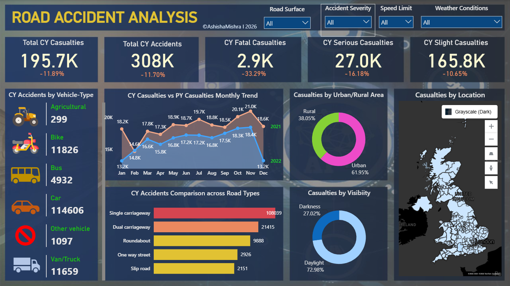

# 🚧 UK Road Accident Analysis

An end-to-end analysis of UK road accident data using **SQL** and **Power BI**, uncovering trends, patterns, and key insights into accident causes and severity.

## SQL Queries

## 📊 Dashboard Overview

The interactive Power BI dashboard highlights:

- **195.7K** total casualties and **308K** total accidents for the current year
- Breakdown of casualties by severity: **Fatal (2.9K)**, **Serious (27.0K)**, and **Slight (165.8K)**
- Monthly trend comparison of casualties (current year vs. previous year)
- Accidents by vehicle type (Car, Bike, Bus, Van/Truck, Agricultural, Other)
- Accident distribution across road types (Single carriageway, Dual carriageway, Roundabout, One-way street, Slip road)
- Casualties by urban vs. rural area, visibility conditions, and geographic location across the UK
- Interactive filters for Road Surface, Accident Severity, Speed Limit, and Weather Conditions

## 🛠️ Tools Used

- **SQL** – Data cleaning, transformation, and querying
- **Power BI** – Data modeling, visualization, and interactive dashboard design

## 🔑 Key Insights

- Urban areas account for the majority of casualties (61.95%) compared to rural areas (38.05%)
- Most accidents occur in daylight (72.98%) rather than darkness (27.02%)
- Single carriageways see significantly higher accident counts than other road types
- Cars are involved in the highest number of accidents by vehicle type

## 🔑 Key Insights

https://app.powerbi.com/view?r=eyJrIjoiNWFmNDE3NzYtYTU0MS00YzIxLWFhZTYtYmIwN2NlZmViOTI3IiwidCI6ImYxNWQ4YWQ1LTViZjYtNDg1NC1iNGRkLTg1MDM1MGNiYjhlMCJ9&embedImagePlaceholder=true

## 📄 License

This project is licensed under the [MIT License](LICENSE).

## 👤 Author

**Ashisha Mishra**
